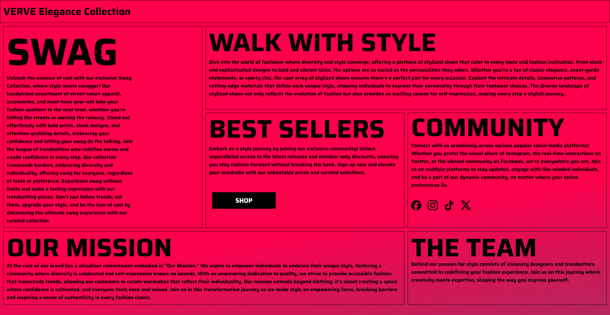
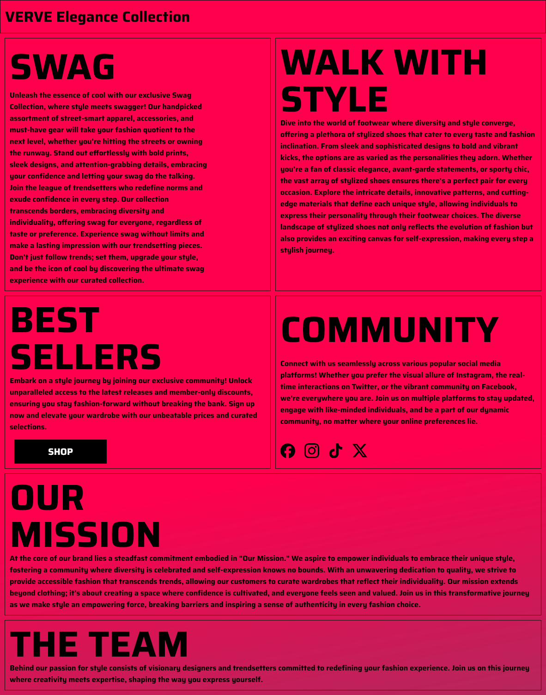
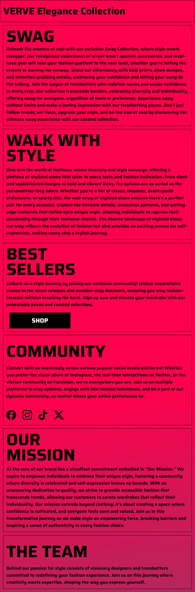

# **ADVERTISEMENT PAGE**
A static "promotional" webpage I created referenced off a figma design I made.

Used CHATGPT for most of the template text.

## About (Not Real Product)

"Welcome to VERVE, where fashion meets individuality, and style is a celebration of uniqueness. At the heart of our brand is a commitment to empowering you to express yourself authentically through your wardrobe. Our curated collections are designed to transcend fleeting trends, offering timeless pieces that resonate with your personal style journey. With a focus on quality, inclusivity, and fostering a sense of community, we invite you to explore VERVE – a space where confidence is cultivated, and each fashion choice becomes a statement of self-expression."

## Utilizes
- HTML
- CSS
- [Saira Font](https://fonts.google.com/specimen/Saira)
- [SVG Logos](https://www.figma.com/community/file/839558611085349133) from FIGMA

## Responsive Design
CSS code was designed to work on most devices, overflow issues possible.

### Desktop Preview

### Tablet Preview

### Mobile Preview
